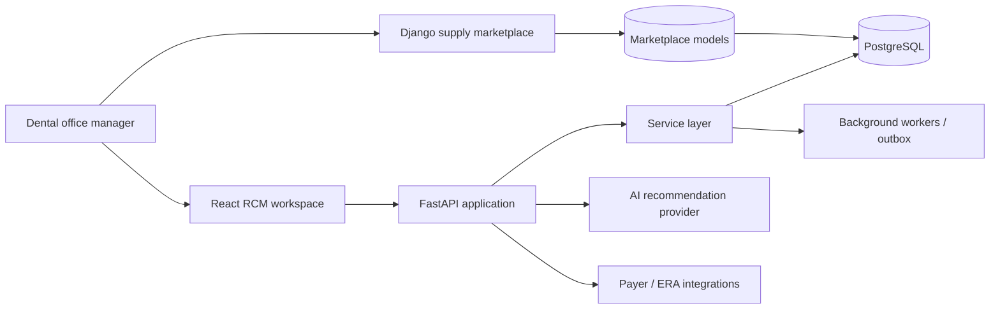

<div align="center">

# Luma

### A modern revenue-cycle workspace for ambitious dental practices

**Luma RCM** gives dental-office teams a calm, high-signal place to manage claims, reconcile payer payments, and take the next best action. **Lakeview Dental Supply** is its intentionally independent, server-rendered marketplace companion.

[](https://www.typescriptlang.org/)
[](https://react.dev/)
[](https://fastapi.tiangolo.com/)
[](https://www.djangoproject.com/)
[](https://www.postgresql.org/)

<a href="#quick-start">Quick start</a> · <a href="#product-tour">Product tour</a> · <a href="#architecture">Architecture</a> · <a href="#engineering-notes">Engineering notes</a>

</div>

---

## Why this project exists

Dental practices often manage revenue through disconnected clearinghouses, payer portals, spreadsheets, and generic task trackers. Luma brings that work into one purpose-built operating surface, with AI positioned as a reviewable assistant—not an autonomous decision-maker.

This repository is also a deliberate full-stack portfolio piece. It shows how a product can serve two different technical realities at once:

| Product | User need | Experience | Technology direction |
| --- | --- | --- | --- |
| **Luma RCM** | Revenue-cycle teams need speed, clarity, and high-confidence actions. | Interactive, data-dense React workspace. | React + TypeScript, query-driven APIs, FastAPI service layer. |
| **Lakeview Dental Supply** | Practices need a dependable, familiar ordering workflow. | Server-rendered marketplace with small JavaScript enhancements. | Django templates, PostgreSQL-ready models, progressive enhancement. |

## Product tour

### 01 — See what needs attention

The RCM overview is built for the first five minutes of an office manager’s day: collections, outstanding A/R, aging, follow-up risk, and the work most likely to protect revenue.

<table>
  <tr>
    <td width="50%"><b>Collection performance</b><br><sub>Trend chart, date-range controls, and payer-health context make the direction of revenue obvious at a glance.</sub></td>
    <td width="50%"><b>A/R attention queue</b><br><sub>Claims requiring follow-up are surfaced with payer, patient, balance, and ownership context—not buried in a report.</sub></td>
  </tr>
</table>

### 02 — Work claims like a real billing team

The claims workspace is deliberately more than a CRUD table:

- Fast patient, claim ID, procedure, and payer search
- Status filtering, sortable columns, pagination affordances, and bulk selection
- At-a-glance balance, claim age, payer, status, and owner context
- Timeline, internal notes, follow-up history, and claim metadata in the detail view
- Status-aware visual hierarchy that helps teams scan exceptions without visual noise

### 03 — Put AI in the workflow, not in a novelty chat window

On a claim, Luma explains the recommended follow-up action, why it is recommended, and its confidence level. A billing specialist can generate an editable draft, copy it, and explicitly mark the work complete.

> **Human in the loop by design.** Recommendations guide a staff member; they never send payer communications or change financial records on their own.

### 04 — Reconcile payments with guardrails

The payment workflow allocates an insurance remittance across open claims in real time. It highlights over-allocation, shows unapplied balance, and only enables reconciliation when the payment is fully and validly allocated.

### 05 — Switch contexts without making the products feel artificially identical

The supply marketplace uses an intentionally different visual language and rendering model. It has a responsive catalog, category filters, cart drawer, quantity controls, local cart persistence, delivery threshold logic, and order tracking—while staying clearly separate from the RCM console.

## Architecture



### Repository map

```text
.
├── app/                         # React/Next RCM demonstration workspace
│   ├── claims/                  # Claims list + detail experience
│   ├── payments/                # Reconciliation UI with allocation validation
│   ├── marketplace/             # Marketplace presentation route
│   ├── tasks/                   # Work queue
│   └── components/rcm/          # Reusable RCM product components
├── backend/                     # FastAPI service boundary
│   └── app/
│       ├── api/routes/          # Thin HTTP handlers
│       ├── core/                # Role and authorization primitives
│       ├── db/                  # SQLAlchemy model definitions + indexes
│       ├── schemas/             # Pydantic input/output contracts
│       └── services/            # Business rules and transaction boundaries
├── marketplace_django/          # Independently deployable Django marketplace
│   └── shop/                    # Catalog, orders, template, progressive JS
└── docs/                        # API and architecture reference material
```

## Engineering notes

| Concern | Implementation approach |
| --- | --- |
| **Multi-tenancy** | Organization IDs are present across the core data model; service lookups are designed to scope every resource to the authenticated organization. |
| **Authorization** | FastAPI role dependencies represent `ADMIN`, `PRACTICE_MANAGER`, `BILLING_SPECIALIST`, and `STAFF` boundaries. UI affordances are never the only protection. |
| **Financial correctness** | Payment allocation service validates exact allocation totals; the production path calls for row locks, an atomic transaction, and an audit event. |
| **Data access** | SQLAlchemy models include indexes for claim status, submission date, payer, patient, organization, payment status, and task ownership. |
| **Explainable AI** | A recommendation returns next action, reason, editable message, and confidence. It is advisory and explicitly human-reviewed. |
| **UX quality** | Responsive layouts, keyboard focus states, real-time feedback, loading-ready patterns, empty states, and error affordances are designed into the operator experience. |
| **Product evolution** | The marketplace’s Django template architecture avoids forcing a mature commerce product into the newer RCM client stack. |

## Quick start

### RCM workspace

```bash
npm install
npm run dev
```

Open [http://localhost:3000](http://localhost:3000), then explore:

| Route | What to try |
| --- | --- |
| [`/overview`](http://localhost:3000/overview) | Change the reporting period; inspect collection trend and claims aging. |
| [`/claims`](http://localhost:3000/claims) | Search, filter, sort, and bulk-select claims. |
| [`/claims/CLM-10482`](http://localhost:3000/claims/CLM-10482) | Add a note and generate an AI-assisted follow-up draft. |
| [`/payments`](http://localhost:3000/payments) | Change allocation values and watch reconciliation guardrails respond. |
| [`/tasks`](http://localhost:3000/tasks) | Complete a priority action in the billing queue. |
| [`/marketplace`](http://localhost:3000/marketplace) | Add supplies to the cart and place a demo order. |

### FastAPI service boundary

```bash
cd backend
python -m venv .venv
source .venv/bin/activate
pip install -r requirements.txt
uvicorn app.main:app --reload
```

### Django marketplace

```bash
cd marketplace_django
python -m venv .venv
source .venv/bin/activate
pip install -r requirements.txt
python manage.py runserver
```

## Quality checks

```bash
npm run typecheck
python -m compileall -q backend marketplace_django
```

## What I would build next

This repository intentionally prioritizes realistic workflows and clear service boundaries over excessive scaffolding. With a production timeline, the next increments would be:

1. Wire the RCM client to typed FastAPI query hooks and a real PostgreSQL migration history.
2. Add ERA/EOB ingestion jobs, idempotent outbox events, and durable audit logging for payment posting.
3. Add OIDC authentication, SSO tenant provisioning, document uploads, and payer-specific integration adapters.
4. Cover claim and allocation rules with unit, API-contract, and end-to-end workflow tests.
5. Add deployment manifests, observability, error tracking, and a CI pipeline that runs checks on every pull request.

---

<div align="center">
  Built as a full-stack product exercise focused on the judgment, workflow design, and code boundaries expected in senior engineering roles.<br><br>
  <sub>Interested in the design decisions? Start with <a href="./docs/architecture.md">the architecture notes</a>.</sub>
</div>
